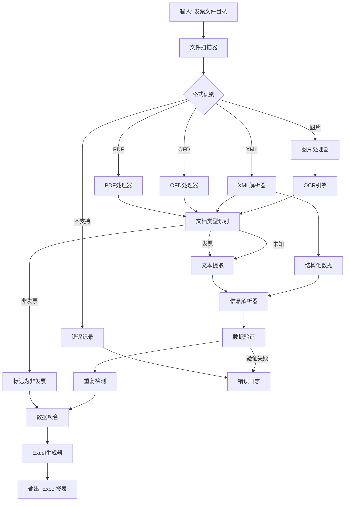

# Design Document: 发票OCR分类系统

## Overview

发票OCR分类系统是一个自动化工具，用于批量处理发票文件、提取关键信息并生成结构化的Excel报表。系统支持多种发票格式（PDF、OFD、XML、图片），能够识别重复发票并保持文件追溯能力。

### 核心功能

1. **多格式文件识别**: 支持PDF、OFD、XML、JPG、PNG、TIFF等格式
2. **文档类型识别**: 自动区分发票文件和非发票文件（如行程单、明细单等）
3. **智能信息提取**: 自动提取发票号、日期、金额、供应商名称等关键字段
4. **重复检测**: 基于发票号识别重复发票，避免重复报销
5. **Excel报表生成**: 将提取的数据整理成结构化的Excel表格
6. **文件追溯**: 在报表中保留原始文件名，便于核对

### 设计目标

- **准确性**: 高精度的OCR识别和信息提取
- **可扩展性**: 易于添加新的发票格式和提取规则
- **易用性**: 简单的批量处理流程，最小化人工干预
- **可追溯性**: 完整的文件名和处理状态记录

## Architecture

### 系统架构

系统采用管道式架构（Pipeline Architecture），将发票处理流程分解为独立的处理阶段：

```
输入文件 → 格式识别 → 文档类型识别 → 内容提取 → 信息解析 → 重复检测 → Excel生成 → 输出报表
```

### 架构层次

```
┌─────────────────────────────────────────────────────────────┐
│                      应用层 (Application Layer)              │
│  ┌──────────────┐  ┌──────────────┐  ┌──────────────┐      │
│  │ 批量处理器    │  │ 报表生成器    │  │ 配置管理器    │      │
│  └──────────────┘  └──────────────┘  └──────────────┘      │
└─────────────────────────────────────────────────────────────┘
┌─────────────────────────────────────────────────────────────┐
│                      业务逻辑层 (Business Logic Layer)        │
│  ┌──────────────┐  ┌──────────────┐  ┌──────────────┐      │
│  │ 信息提取器    │  │ 重复检测器    │  │ 数据验证器    │      │
│  └──────────────┘  └──────────────┘  └──────────────┘      │
└─────────────────────────────────────────────────────────────┘
┌─────────────────────────────────────────────────────────────┐
│                      数据处理层 (Data Processing Layer)       │
│  ┌──────────────┐  ┌──────────────┐  ┌──────────────┐      │
│  │ PDF处理器     │  │ OFD处理器     │  │ XML解析器     │      │
│  ├──────────────┤  ├──────────────┤  ├──────────────┤      │
│  │ 图片处理器    │  │ OCR引擎       │  │ 文本解析器    │      │
│  └──────────────┘  └──────────────┘  └──────────────┘      │
└─────────────────────────────────────────────────────────────┘
┌─────────────────────────────────────────────────────────────┐
│                      基础设施层 (Infrastructure Layer)        │
│  ┌──────────────┐  ┌──────────────┐  ┌──────────────┐      │
│  │ 文件系统      │  │ 日志系统      │  │ 错误处理      │      │
│  └──────────────┘  └──────────────┘  └──────────────┘      │
└─────────────────────────────────────────────────────────────┘
```

### 处理流程



## Components and Interfaces

### 1. FileScanner (文件扫描器)

**职责**: 扫描输入目录，识别所有待处理的发票文件

**接口**:
```python
class FileScanner:
    def scan_directory(self, directory_path: str) -> List[FileInfo]:
        """扫描目录并返回文件信息列表"""
        pass
    
    def identify_format(self, file_path: str) -> FileFormat:
        """识别文件格式"""
        pass
```

**输入**: 目录路径
**输出**: 文件信息列表 (文件路径、格式、大小等)

### 2. FormatProcessor (格式处理器)

**职责**: 根据文件格式选择合适的处理器提取内容

**接口**:
```python
class FormatProcessor(ABC):
    @abstractmethod
    def can_process(self, file_format: FileFormat) -> bool:
        """判断是否能处理该格式"""
        pass
    
    @abstractmethod
    def extract_content(self, file_path: str) -> ExtractedContent:
        """提取文件内容"""
        pass

class PDFProcessor(FormatProcessor):
    """处理PDF格式发票"""
    pass

class OFDProcessor(FormatProcessor):
    """处理OFD格式发票（中国电子发票标准格式）"""
    pass

class XMLProcessor(FormatProcessor):
    """处理XML格式发票（结构化电子发票）"""
    pass

class ImageProcessor(FormatProcessor):
    """处理图片格式发票（JPG、PNG、TIFF）"""
    pass
```

**输入**: 文件路径和格式类型
**输出**: 提取的内容（文本或结构化数据）

### 3. DocumentTypeClassifier (文档类型分类器)

**职责**: 识别文档是发票还是非发票文件

**接口**:
```python
class DocumentTypeClassifier:
    def classify_document(self, file_info: FileInfo, content: ExtractedContent) -> DocumentType:
        """分类文档类型"""
        pass
    
    def check_filename_keywords(self, file_name: str) -> Optional[DocumentType]:
        """通过文件名关键词识别"""
        pass
    
    def check_content_keywords(self, content: ExtractedContent) -> Optional[DocumentType]:
        """通过文档内容识别"""
        pass
    
    def get_confidence_score(self, file_info: FileInfo, content: ExtractedContent) -> float:
        """获取分类置信度"""
        pass
```

**识别策略**:

1. **文件名关键词检测**:
   - **非发票关键词**: "行程单"、"明细单"、"附件"、"清单"、"通知"、"说明"
   - **发票关键词**: "发票"、"invoice"
   - 优先级: 非发票关键词 > 发票关键词

2. **内容关键词检测**:
   - **发票特征字段**: "发票"、"发票号"、"发票代码"、"发票号码"、"税额"、"价税合计"
   - **非发票特征**: 缺少上述关键字段
   - 阈值: 至少包含2个发票特征字段才认定为发票

3. **分类决策流程**:
   ```
   1. 检查文件名关键词
      - 如果包含非发票关键词 → 非发票
      - 如果包含发票关键词 → 继续内容检测
   
   2. 检查内容关键词
      - 如果包含≥2个发票特征字段 → 发票
      - 如果包含<2个发票特征字段 → 非发票
   
   3. 如果无法确定 → 未知类型（记录警告）
   ```

4. **置信度计算**:
   - 文件名匹配: 0.7
   - 内容匹配2个字段: 0.6
   - 内容匹配3个字段: 0.8
   - 内容匹配≥4个字段: 0.95

**输入**: 文件信息、提取的内容
**输出**: 文档类型（发票/非发票/未知）

### 4. OCREngine (OCR引擎)

**职责**: 对图片和PDF进行光学字符识别

**接口**:
```python
class OCREngine:
    def recognize_text(self, image_data: bytes) -> str:
        """识别图片中的文本"""
        pass
    
    def recognize_with_layout(self, image_data: bytes) -> LayoutText:
        """识别文本并保留布局信息"""
        pass
```

**技术选型**:
- **主要选项**: Tesseract OCR (开源)、PaddleOCR (中文优化)、百度OCR API、腾讯OCR API
- **推荐**: PaddleOCR - 对中文发票识别效果好，支持离线部署

**输入**: 图片数据
**输出**: 识别的文本内容

### 5. InvoiceParser (发票解析器)

**职责**: 从提取的文本或结构化数据中解析发票关键信息

**接口**:
```python
class InvoiceParser:
    def parse_invoice(self, content: ExtractedContent) -> InvoiceData:
        """解析发票信息"""
        pass
    
    def extract_invoice_number(self, text: str) -> Optional[str]:
        """提取发票号"""
        pass
    
    def extract_date(self, text: str) -> Optional[datetime]:
        """提取发票日期"""
        pass
    
    def extract_amount(self, text: str) -> Optional[Decimal]:
        """提取发票金额"""
        pass
    
    def extract_vendor(self, text: str) -> Optional[str]:
        """提取供应商名称"""
        pass
```

**解析策略**:
- **XML格式**: 直接从XML节点提取（如 `<InvoiceNumber>`, `<TotalTax-includedAmount>`）
- **文本格式**: 使用正则表达式和关键词匹配
  - 发票号: 匹配数字序列（通常20位）
  - 日期: 匹配日期格式（YYYY-MM-DD、YYYY/MM/DD等）
  - 金额: 匹配货币格式（包含小数点的数字）
  - 供应商: 匹配"销售方"、"收款方"等关键词后的文本

**输入**: 提取的内容
**输出**: 结构化的发票数据

### 6. DuplicateDetector (重复检测器)

**职责**: 识别重复的发票记录

**接口**:
```python
class DuplicateDetector:
    def detect_duplicates(self, invoices: List[InvoiceData]) -> DuplicateReport:
        """检测重复发票"""
        pass
    
    def mark_duplicates(self, invoices: List[InvoiceData]) -> List[InvoiceData]:
        """标记重复发票"""
        pass
    
    def configure_sensitivity(self, sensitivity: DuplicateSensitivity):
        """配置重复检测灵敏度"""
        pass
```

**检测策略**:
- **主键匹配**: 基于发票号进行精确匹配
- **模糊匹配**: 基于发票号、日期、金额的组合进行相似度计算
- **灵敏度配置**:
  - 严格模式: 仅发票号完全相同
  - 标准模式: 发票号相同或（日期+金额+供应商）相同
  - 宽松模式: 相似度超过阈值（如90%）

**输入**: 发票数据列表
**输出**: 标记了重复状态的发票数据列表

### 7. ExcelGenerator (Excel生成器)

**职责**: 将处理后的发票数据生成Excel报表

**接口**:
```python
class ExcelGenerator:
    def generate_report(self, invoices: List[InvoiceData], output_path: str):
        """生成Excel报表"""
        pass
    
    def format_worksheet(self, worksheet: Worksheet):
        """格式化工作表（列宽、样式等）"""
        pass
```

**报表结构**:
| 列名 | 说明 | 数据类型 |
|------|------|----------|
| 序号 | 自动编号 | 整数 |
| 文件名 | 原始文件名（含扩展名） | 文本 |
| 文档类型 | 发票/非发票文件/未知类型 | 文本 |
| 发票号 | 发票号码 | 文本 |
| 发票日期 | 开票日期 | 日期 |
| 金额（元） | 发票金额 | 数字（保留2位小数） |
| 供应商名称 | 销售方/收款方名称 | 文本 |
| 是否重复 | 重复标记 | 文本（是/否） |
| 重复文件 | 重复的其他文件名 | 文本 |
| 提取状态 | 信息提取完整性 | 文本（完整/不完整） |
| 备注 | 错误信息或其他说明 | 文本 |

**技术选型**: openpyxl 或 xlsxwriter (Python)

**输入**: 发票数据列表、输出路径
**输出**: Excel文件

### 8. ErrorHandler (错误处理器)

**职责**: 统一处理和记录错误

**接口**:
```python
class ErrorHandler:
    def log_error(self, file_path: str, error: Exception, context: dict):
        """记录错误"""
        pass
    
    def get_error_summary(self) -> ErrorSummary:
        """获取错误摘要"""
        pass
```

**错误类型**:
- 文件格式不支持
- OCR识别失败
- 信息提取不完整
- 文件读取错误
- 数据验证失败

## Data Models

### FileInfo (文件信息)

```python
@dataclass
class FileInfo:
    file_path: str          # 文件完整路径
    file_name: str          # 文件名（含扩展名）
    file_format: FileFormat # 文件格式
    file_size: int          # 文件大小（字节）
    created_time: datetime  # 文件创建时间
```

### FileFormat (文件格式枚举)

```python
class FileFormat(Enum):
    PDF = "pdf"
    OFD = "ofd"
    XML = "xml"
    JPG = "jpg"
    PNG = "png"
    TIFF = "tiff"
    UNSUPPORTED = "unsupported"
```

### DocumentType (文档类型枚举)

```python
class DocumentType(Enum):
    INVOICE = "发票"              # 发票文件
    NON_INVOICE = "非发票文件"    # 非发票文件（行程单、明细单等）
    UNKNOWN = "未知类型"          # 无法确定类型
```

### ExtractedContent (提取的内容)

```python
@dataclass
class ExtractedContent:
    content_type: ContentType  # 内容类型（文本/结构化）
    raw_text: Optional[str]    # 原始文本
    structured_data: Optional[dict]  # 结构化数据（XML解析结果）
    confidence: float          # 提取置信度（0-1）
```

### InvoiceData (发票数据)

```python
@dataclass
class InvoiceData:
    file_name: str                    # 原始文件名
    document_type: DocumentType       # 文档类型（发票/非发票/未知）
    invoice_number: Optional[str]     # 发票号
    invoice_date: Optional[datetime]  # 发票日期
    amount: Optional[Decimal]         # 发票金额
    vendor_name: Optional[str]        # 供应商名称
    is_duplicate: bool                # 是否重复
    duplicate_files: List[str]        # 重复的其他文件名
    extraction_status: ExtractionStatus  # 提取状态
    error_message: Optional[str]      # 错误信息
    classification_confidence: float  # 文档类型分类置信度
    raw_data: dict                    # 原始数据（用于调试）
```

### ExtractionStatus (提取状态枚举)

```python
class ExtractionStatus(Enum):
    COMPLETE = "完整"           # 所有字段都成功提取
    INCOMPLETE = "不完整"       # 部分字段提取失败
    FAILED = "失败"             # 完全提取失败
```

### DuplicateSensitivity (重复检测灵敏度)

```python
class DuplicateSensitivity(Enum):
    STRICT = "strict"      # 严格模式
    STANDARD = "standard"  # 标准模式
    LOOSE = "loose"        # 宽松模式
```

### DuplicateReport (重复检测报告)

```python
@dataclass
class DuplicateReport:
    total_invoices: int              # 总发票数
    unique_invoices: int             # 唯一发票数
    duplicate_groups: List[List[InvoiceData]]  # 重复组
```


## Correctness Properties

*A property is a characteristic or behavior that should hold true across all valid executions of a system—essentially, a formal statement about what the system should do. Properties serve as the bridge between human-readable specifications and machine-verifiable correctness guarantees.*

### Property 1: Format Identification Correctness

*For any* file with a recognized extension (PDF, OFD, XML, JPG, PNG, TIFF), the system should correctly identify its format type, and for any file with an unrecognized extension, the system should return an unsupported format error with a descriptive message.

**Validates: Requirements 1.1, 1.2, 1.3**

### Property 2: Content Extraction Completeness

*For any* valid invoice file in a supported format, the system should successfully extract content (either text or structured data) without throwing an exception.

**Validates: Requirements 1.4**

### Property 3: Field Extraction Consistency

*For any* extracted content containing valid invoice information, if the parser successfully extracts a field (invoice number, date, amount, or vendor name), then that field should be non-null and non-empty in the resulting InvoiceData object.

**Validates: Requirements 2.1, 2.2, 2.3, 2.4**

### Property 4: Incomplete Extraction Marking

*For any* invoice file where one or more required fields cannot be extracted, the system should mark the extraction status as INCOMPLETE or FAILED and include an error message describing which fields are missing.

**Validates: Requirements 2.5**

### Property 5: XML Parsing Round Trip

*For any* valid XML invoice file, parsing the XML structure and then extracting the invoice data should preserve the key fields (invoice number, date, amount, vendor) exactly as they appear in the XML nodes.

**Validates: Requirements 1.4, 2.1, 2.2, 2.3, 2.4**

### Property 6: Excel Generation Completeness

*For any* non-empty list of InvoiceData objects, the system should generate a valid Excel file that can be opened without errors.

**Validates: Requirements 3.1**

### Property 7: Excel Schema Correctness

*For any* generated Excel report, the worksheet should contain all required columns: 序号, 文件名, 发票号, 发票日期, 金额（元）, 供应商名称, 是否重复, 重复文件, 提取状态, 备注.

**Validates: Requirements 3.2, 3.3, 4.5**

### Property 8: Batch Processing Completeness

*For any* collection of N invoice files processed together, the generated Excel report should contain exactly N rows (excluding the header row), with each row corresponding to one input file.

**Validates: Requirements 3.4**

### Property 9: Output Path Preservation

*For any* valid output path specified by the user, if the system has write permissions, the Excel file should be created at exactly that path with the correct file name.

**Validates: Requirements 3.5**

### Property 10: Duplicate Detection by Invoice Number

*For any* set of invoices where two or more have identical non-empty invoice numbers, the system should mark all but the first occurrence as duplicates.

**Validates: Requirements 4.1, 4.2**

### Property 11: Duplicate File Name Recording

*For any* invoice marked as duplicate, the Excel report should list all file names associated with that invoice number in the "重复文件" column.

**Validates: Requirements 4.4, 5.3**

### Property 12: Unique Invoice Counting

*For any* set of invoices containing duplicates, the count of unique invoices should equal the number of distinct invoice numbers (treating null/empty invoice numbers as unique).

**Validates: Requirements 4.3**

### Property 13: Sensitivity Configuration Effect

*For any* duplicate detection sensitivity setting (STRICT, STANDARD, LOOSE), changing the sensitivity should affect which invoices are marked as duplicates, with STRICT finding fewer duplicates than STANDARD, and STANDARD finding fewer than LOOSE.

**Validates: Requirements 4.6**

### Property 14: File Name Preservation with Extension

*For any* invoice file processed, the file name recorded in the Excel report should exactly match the original file name including the file extension.

**Validates: Requirements 5.1, 5.2**

### Property 15: Error Handling Idempotence

*For any* file that causes an extraction error, processing it multiple times should produce the same error message and extraction status each time.

**Validates: Requirements 2.5**

### Property 16: Document Type Classification Completeness

*For any* processed file, the system should assign a document type (INVOICE, NON_INVOICE, or UNKNOWN) and never leave the document_type field null.

**Validates: Requirements 6.1**

### Property 17: Filename-Based Non-Invoice Detection

*For any* file whose name contains non-invoice keywords ("行程单", "明细单", "附件", "清单", "通知", "说明"), the system should classify it as NON_INVOICE.

**Validates: Requirements 6.2**

### Property 18: Content-Based Invoice Classification

*For any* document content containing at least 2 invoice-specific keywords ("发票", "发票号", "发票代码", "发票号码", "税额", "价税合计"), the system should classify it as INVOICE (unless filename indicates otherwise).

**Validates: Requirements 6.3, 6.4**

### Property 19: Non-Invoice Extraction Skipping

*For any* file classified as NON_INVOICE, the invoice-specific fields (invoice_number, invoice_date, amount, vendor_name) should remain null or empty, indicating that extraction was skipped.

**Validates: Requirements 6.6**

### Property 20: Document Type Excel Column Presence

*For any* generated Excel report, the worksheet should contain a "文档类型" column, and every row should have a non-empty value in this column (发票/非发票文件/未知类型).

**Validates: Requirements 6.5, 6.7**

### Property 21: Unknown Type Warning Logging

*For any* file that cannot be confidently classified (confidence score below threshold), the system should mark it as UNKNOWN and generate a warning log entry.

**Validates: Requirements 6.8**

## Error Handling

### Error Categories

1. **File Access Errors**
   - 文件不存在
   - 文件无法读取（权限问题）
   - 文件损坏或格式错误

2. **Format Processing Errors**
   - 不支持的文件格式
   - PDF/OFD解析失败
   - XML格式不符合预期结构

3. **OCR Errors**
   - OCR引擎初始化失败
   - 图片质量过低导致识别失败
   - OCR服务超时或配额限制

4. **Parsing Errors**
   - 无法找到必需字段
   - 日期格式无法解析
   - 金额格式无法解析

5. **Classification Errors**
   - 文档类型无法确定（置信度过低）
   - 文件名和内容特征冲突
   - 关键词检测失败

6. **Output Errors**
   - 输出目录不存在或无写权限
   - Excel生成失败
   - 磁盘空间不足

### Error Handling Strategy

#### 1. 分层错误处理

```python
try:
    # 文件处理
    content = processor.extract_content(file_path)
except FileNotFoundError:
    # 记录错误，继续处理下一个文件
    error_handler.log_error(file_path, "文件不存在", ErrorLevel.ERROR)
    continue
except UnsupportedFormatError as e:
    # 记录错误，继续处理下一个文件
    error_handler.log_error(file_path, f"不支持的格式: {e}", ErrorLevel.WARNING)
    continue
except Exception as e:
    # 未预期的错误，记录详细信息
    error_handler.log_error(file_path, f"处理失败: {e}", ErrorLevel.CRITICAL)
    continue
```

#### 2. 优雅降级

- **部分字段提取失败**: 继续处理，标记为"不完整"
- **OCR识别置信度低**: 保留结果但添加警告标记
- **重复检测失败**: 跳过重复检测，所有发票标记为非重复

#### 3. 错误日志

所有错误记录到日志文件，包含：
- 时间戳
- 文件路径
- 错误类型
- 错误详情
- 堆栈跟踪（对于异常）

#### 4. 用户反馈

在Excel报表中：
- "提取状态"列显示处理结果
- "备注"列显示错误信息或警告
- 使用颜色标记（红色=失败，黄色=不完整，绿色=成功）

### Error Recovery

1. **重试机制**: 对于临时性错误（如网络超时），自动重试最多3次
2. **跳过机制**: 单个文件失败不影响批处理的其他文件
3. **手动干预**: 对于无法自动处理的文件，在报表中明确标记，供用户手动处理

## Testing Strategy

### 测试方法论

本系统采用**双轨测试策略**，结合单元测试和基于属性的测试（Property-Based Testing, PBT）：

- **单元测试**: 验证特定示例、边缘情况和错误条件
- **属性测试**: 验证跨所有输入的通用属性

两者互补，共同确保全面覆盖：单元测试捕获具体的bug，属性测试验证一般正确性。

### Property-Based Testing 配置

**测试库选择**: 
- Python: **Hypothesis** (推荐)
- 备选: pytest-quickcheck

**配置要求**:
- 每个属性测试最少运行 **100次迭代**
- 每个测试必须引用设计文档中的属性
- 标签格式: `# Feature: invoice-ocr-classification, Property {number}: {property_text}`

### 测试计划

#### 1. 单元测试

**文件格式识别测试**:
```python
def test_identify_pdf_format():
    """测试PDF格式识别"""
    scanner = FileScanner()
    format = scanner.identify_format("sample.pdf")
    assert format == FileFormat.PDF

def test_identify_ofd_format():
    """测试OFD格式识别"""
    scanner = FileScanner()
    format = scanner.identify_format("sample.ofd")
    assert format == FileFormat.OFD

def test_unsupported_format_error():
    """测试不支持格式的错误处理"""
    scanner = FileScanner()
    format = scanner.identify_format("sample.doc")
    assert format == FileFormat.UNSUPPORTED
```

**XML解析测试**:
```python
def test_parse_gaode_invoice_xml():
    """测试解析高德电子发票XML"""
    processor = XMLProcessor()
    content = processor.extract_content("Samples/【曹操出行-37.74元-1个行程】高德打车电子发票.xml")
    
    parser = InvoiceParser()
    invoice = parser.parse_invoice(content)
    
    assert invoice.invoice_number == "26327000000409454000"
    assert invoice.amount == Decimal("37.74")
    assert invoice.vendor_name == "苏州市吉利优行电子科技有限公司"
    assert invoice.invoice_date.year == 2026
```

**重复检测测试**:
```python
def test_detect_exact_duplicates():
    """测试精确重复检测"""
    invoices = [
        InvoiceData(file_name="file1.pdf", invoice_number="12345", ...),
        InvoiceData(file_name="file2.pdf", invoice_number="12345", ...),
        InvoiceData(file_name="file3.pdf", invoice_number="67890", ...),
    ]
    
    detector = DuplicateDetector()
    result = detector.mark_duplicates(invoices)
    
    assert result[0].is_duplicate == False
    assert result[1].is_duplicate == True
    assert result[1].duplicate_files == ["file1.pdf"]
    assert result[2].is_duplicate == False
```

**边缘情况测试**:
```python
def test_empty_file():
    """测试空文件处理"""
    # 应该优雅处理，不崩溃

def test_corrupted_pdf():
    """测试损坏的PDF文件"""
    # 应该返回错误，不崩溃

def test_missing_invoice_number():
    """测试缺少发票号的情况"""
    # 应该标记为不完整

def test_invalid_date_format():
    """测试无效日期格式"""
    # 应该标记为不完整或使用默认值

def test_special_characters_in_filename():
    """测试文件名包含特殊字符"""
    # 应该正确保留文件名
```

**文档类型识别测试**:
```python
def test_classify_itinerary_by_filename():
    """测试通过文件名识别行程单"""
    classifier = DocumentTypeClassifier()
    file_info = FileInfo(file_name="电子行程单.pdf", ...)
    content = ExtractedContent(raw_text="...", ...)
    
    doc_type = classifier.classify_document(file_info, content)
    assert doc_type == DocumentType.NON_INVOICE

def test_classify_invoice_by_content():
    """测试通过内容识别发票"""
    classifier = DocumentTypeClassifier()
    file_info = FileInfo(file_name="document.pdf", ...)
    content = ExtractedContent(
        raw_text="发票号: 12345678 发票代码: 987654 税额: 100.00",
        ...
    )
    
    doc_type = classifier.classify_document(file_info, content)
    assert doc_type == DocumentType.INVOICE

def test_non_invoice_skips_extraction():
    """测试非发票文件跳过信息提取"""
    invoice_data = InvoiceData(
        file_name="行程单.pdf",
        document_type=DocumentType.NON_INVOICE,
        ...
    )
    
    assert invoice_data.invoice_number is None
    assert invoice_data.amount is None
    assert invoice_data.vendor_name is None

def test_excel_contains_document_type_column():
    """测试Excel包含文档类型列"""
    invoices = [
        InvoiceData(file_name="invoice.pdf", document_type=DocumentType.INVOICE, ...),
        InvoiceData(file_name="itinerary.pdf", document_type=DocumentType.NON_INVOICE, ...),
    ]
    
    generator = ExcelGenerator()
    output_file = "test_output.xlsx"
    generator.generate_report(invoices, output_file)
    
    wb = openpyxl.load_workbook(output_file)
    ws = wb.active
    
    # 验证文档类型列存在（假设在第3列）
    assert ws.cell(row=1, column=3).value == "文档类型"
    assert ws.cell(row=2, column=3).value == "发票"
    assert ws.cell(row=3, column=3).value == "非发票文件"
```

#### 2. 属性测试 (Property-Based Tests)

**Property 1: Format Identification Correctness**
```python
from hypothesis import given, strategies as st

@given(st.sampled_from(['.pdf', '.ofd', '.xml', '.jpg', '.png', '.tiff']))
def test_property_format_identification_supported(extension):
    """
    Feature: invoice-ocr-classification, Property 1: 
    For any file with a recognized extension, the system should correctly identify its format type
    """
    scanner = FileScanner()
    test_file = f"test_file{extension}"
    format = scanner.identify_format(test_file)
    assert format != FileFormat.UNSUPPORTED
    assert format.value == extension.lstrip('.')

@given(st.text().filter(lambda x: x not in ['.pdf', '.ofd', '.xml', '.jpg', '.png', '.tiff']))
def test_property_format_identification_unsupported(extension):
    """
    Feature: invoice-ocr-classification, Property 1: 
    For any file with an unrecognized extension, the system should return unsupported format error
    """
    scanner = FileScanner()
    test_file = f"test_file{extension}"
    format = scanner.identify_format(test_file)
    assert format == FileFormat.UNSUPPORTED
```

**Property 5: XML Parsing Round Trip**
```python
@given(st.builds(generate_valid_invoice_xml))
def test_property_xml_round_trip(xml_data):
    """
    Feature: invoice-ocr-classification, Property 5: 
    For any valid XML invoice, parsing should preserve key fields exactly
    """
    # 生成XML文件
    xml_file = create_temp_xml(xml_data)
    
    # 解析
    processor = XMLProcessor()
    content = processor.extract_content(xml_file)
    parser = InvoiceParser()
    invoice = parser.parse_invoice(content)
    
    # 验证字段保留
    assert invoice.invoice_number == xml_data['invoice_number']
    assert invoice.amount == Decimal(xml_data['amount'])
    assert invoice.vendor_name == xml_data['vendor_name']
```

**Property 8: Batch Processing Completeness**
```python
@given(st.lists(st.builds(generate_invoice_data), min_size=1, max_size=100))
def test_property_batch_processing_completeness(invoice_list):
    """
    Feature: invoice-ocr-classification, Property 8: 
    For any collection of N invoices, the Excel report should contain exactly N rows
    """
    generator = ExcelGenerator()
    output_file = "test_output.xlsx"
    generator.generate_report(invoice_list, output_file)
    
    # 读取Excel验证行数
    wb = openpyxl.load_workbook(output_file)
    ws = wb.active
    row_count = ws.max_row - 1  # 减去表头
    
    assert row_count == len(invoice_list)
```

**Property 10: Duplicate Detection by Invoice Number**
```python
@given(st.lists(st.builds(generate_invoice_data), min_size=2, max_size=50))
def test_property_duplicate_detection(invoice_list):
    """
    Feature: invoice-ocr-classification, Property 10: 
    For any set of invoices with identical invoice numbers, all but first should be marked as duplicates
    """
    # 确保有重复
    if len(invoice_list) >= 2:
        invoice_list[1].invoice_number = invoice_list[0].invoice_number
    
    detector = DuplicateDetector()
    result = detector.mark_duplicates(invoice_list)
    
    # 验证重复标记
    invoice_numbers = {}
    for invoice in result:
        if invoice.invoice_number:
            if invoice.invoice_number in invoice_numbers:
                assert invoice.is_duplicate == True
            else:
                invoice_numbers[invoice.invoice_number] = True
                assert invoice.is_duplicate == False
```

**Property 14: File Name Preservation with Extension**
```python
@given(st.text(min_size=1, max_size=50), st.sampled_from(['.pdf', '.ofd', '.xml', '.jpg']))
def test_property_filename_preservation(base_name, extension):
    """
    Feature: invoice-ocr-classification, Property 14: 
    For any invoice file, the recorded file name should exactly match the original including extension
    """
    original_filename = f"{base_name}{extension}"
    invoice = InvoiceData(file_name=original_filename, ...)
    
    generator = ExcelGenerator()
    output_file = "test_output.xlsx"
    generator.generate_report([invoice], output_file)
    
    # 读取Excel验证文件名
    wb = openpyxl.load_workbook(output_file)
    ws = wb.active
    recorded_filename = ws.cell(row=2, column=2).value  # 假设文件名在第2列
    
    assert recorded_filename == original_filename
```

**Property 16: Document Type Classification Completeness**
```python
@given(st.builds(generate_file_info), st.builds(generate_extracted_content))
def test_property_document_type_completeness(file_info, content):
    """
    Feature: invoice-ocr-classification, Property 16: 
    For any processed file, the system should assign a document type and never leave it null
    """
    classifier = DocumentTypeClassifier()
    doc_type = classifier.classify_document(file_info, content)
    
    assert doc_type is not None
    assert doc_type in [DocumentType.INVOICE, DocumentType.NON_INVOICE, DocumentType.UNKNOWN]
```

**Property 17: Filename-Based Non-Invoice Detection**
```python
@given(
    st.text(min_size=1, max_size=30),
    st.sampled_from(["行程单", "明细单", "附件", "清单", "通知", "说明"]),
    st.sampled_from(['.pdf', '.jpg', '.png'])
)
def test_property_filename_non_invoice_detection(base_name, keyword, extension):
    """
    Feature: invoice-ocr-classification, Property 17: 
    For any file whose name contains non-invoice keywords, the system should classify it as NON_INVOICE
    """
    file_name = f"{base_name}{keyword}{extension}"
    file_info = FileInfo(file_name=file_name, ...)
    content = ExtractedContent(raw_text="一些文本内容", ...)
    
    classifier = DocumentTypeClassifier()
    doc_type = classifier.classify_document(file_info, content)
    
    assert doc_type == DocumentType.NON_INVOICE
```

**Property 18: Content-Based Invoice Classification**
```python
@given(
    st.lists(
        st.sampled_from(["发票", "发票号", "发票代码", "发票号码", "税额", "价税合计"]),
        min_size=2,
        max_size=6,
        unique=True
    ),
    st.text(min_size=10, max_size=100)
)
def test_property_content_invoice_classification(invoice_keywords, filler_text):
    """
    Feature: invoice-ocr-classification, Property 18: 
    For any document content containing at least 2 invoice-specific keywords, 
    the system should classify it as INVOICE
    """
    # 构造包含发票关键词的内容
    content_text = filler_text + " " + " ".join(invoice_keywords)
    
    file_info = FileInfo(file_name="document.pdf", ...)
    content = ExtractedContent(raw_text=content_text, ...)
    
    classifier = DocumentTypeClassifier()
    doc_type = classifier.classify_document(file_info, content)
    
    # 如果文件名没有非发票关键词，应该分类为发票
    assert doc_type == DocumentType.INVOICE
```

**Property 19: Non-Invoice Extraction Skipping**
```python
@given(st.builds(generate_file_info), st.builds(generate_extracted_content))
def test_property_non_invoice_extraction_skipping(file_info, content):
    """
    Feature: invoice-ocr-classification, Property 19: 
    For any file classified as NON_INVOICE, invoice-specific fields should remain null
    """
    # 强制分类为非发票
    file_info.file_name = "行程单.pdf"
    
    classifier = DocumentTypeClassifier()
    doc_type = classifier.classify_document(file_info, content)
    
    if doc_type == DocumentType.NON_INVOICE:
        # 模拟处理流程
        invoice_data = process_file(file_info, content, doc_type)
        
        assert invoice_data.invoice_number is None
        assert invoice_data.invoice_date is None
        assert invoice_data.amount is None
        assert invoice_data.vendor_name is None
```

**Property 20: Document Type Excel Column Presence**
```python
@given(st.lists(st.builds(generate_invoice_data_with_doc_type), min_size=1, max_size=50))
def test_property_document_type_excel_column(invoice_list):
    """
    Feature: invoice-ocr-classification, Property 20: 
    For any generated Excel report, the document type column should exist and be populated
    """
    generator = ExcelGenerator()
    output_file = "test_output.xlsx"
    generator.generate_report(invoice_list, output_file)
    
    wb = openpyxl.load_workbook(output_file)
    ws = wb.active
    
    # 验证列标题
    headers = [cell.value for cell in ws[1]]
    assert "文档类型" in headers
    
    doc_type_col = headers.index("文档类型") + 1
    
    # 验证每行都有文档类型值
    for row_idx in range(2, ws.max_row + 1):
        doc_type_value = ws.cell(row=row_idx, column=doc_type_col).value
        assert doc_type_value is not None
        assert doc_type_value in ["发票", "非发票文件", "未知类型"]
```

**Property 21: Unknown Type Warning Logging**
```python
@given(st.builds(generate_ambiguous_file_content))
def test_property_unknown_type_warning(ambiguous_content):
    """
    Feature: invoice-ocr-classification, Property 21: 
    For any file that cannot be confidently classified, the system should mark it as UNKNOWN 
    and log a warning
    """
    file_info = FileInfo(file_name="document.pdf", ...)
    
    classifier = DocumentTypeClassifier()
    confidence = classifier.get_confidence_score(file_info, ambiguous_content)
    
    if confidence < 0.5:  # 低置信度阈值
        doc_type = classifier.classify_document(file_info, ambiguous_content)
        assert doc_type == DocumentType.UNKNOWN
        
        # 验证警告日志（需要mock日志系统）
        # assert warning_logged(file_info.file_name, "无法确定文档类型")
```

#### 3. 集成测试

**端到端测试**:
```python
def test_end_to_end_processing():
    """测试完整的处理流程"""
    # 1. 准备测试数据
    test_dir = "test_samples/"
    output_file = "test_output.xlsx"
    
    # 2. 运行系统
    processor = InvoiceProcessor()
    processor.process_directory(test_dir, output_file)
    
    # 3. 验证输出
    assert os.path.exists(output_file)
    wb = openpyxl.load_workbook(output_file)
    ws = wb.active
    assert ws.max_row > 1  # 至少有数据行
    
    # 4. 验证数据质量
    for row in ws.iter_rows(min_row=2, values_only=True):
        file_name, invoice_num, date, amount, vendor, is_dup, dup_files, status, remark = row
        assert file_name is not None
        assert status in ["完整", "不完整", "失败"]
```

**性能测试**:
```python
def test_performance_100_files():
    """测试处理100个文件的性能"""
    import time
    
    start_time = time.time()
    processor = InvoiceProcessor()
    processor.process_directory("large_test_set/", "output.xlsx")
    elapsed_time = time.time() - start_time
    
    # 期望每个文件平均处理时间 < 5秒
    assert elapsed_time < 500
```

### 测试数据生成

**Hypothesis策略定义**:
```python
from hypothesis import strategies as st

# 发票号生成器（20位数字）
invoice_number_strategy = st.text(
    alphabet=st.characters(whitelist_categories=('Nd',)),
    min_size=20,
    max_size=20
)

# 金额生成器（正数，最多2位小数）
amount_strategy = st.decimals(
    min_value=0.01,
    max_value=999999.99,
    places=2
)

# 日期生成器
date_strategy = st.datetimes(
    min_value=datetime(2020, 1, 1),
    max_value=datetime(2030, 12, 31)
)

# 供应商名称生成器
vendor_strategy = st.text(
    alphabet=st.characters(whitelist_categories=('L',)),
    min_size=5,
    max_size=50
)

# 文档类型生成器
document_type_strategy = st.sampled_from([
    DocumentType.INVOICE,
    DocumentType.NON_INVOICE,
    DocumentType.UNKNOWN
])

# 非发票关键词生成器
non_invoice_keywords_strategy = st.sampled_from([
    "行程单", "明细单", "附件", "清单", "通知", "说明"
])

# 发票关键词生成器
invoice_keywords_strategy = st.sampled_from([
    "发票", "发票号", "发票代码", "发票号码", "税额", "价税合计"
])

# 文件信息生成器
def generate_file_info():
    return st.builds(
        FileInfo,
        file_path=st.text(min_size=5, max_size=100),
        file_name=st.text(min_size=1, max_size=50),
        file_format=st.sampled_from(FileFormat),
        file_size=st.integers(min_value=0, max_value=10000000),
        created_time=date_strategy
    )

# 提取内容生成器
def generate_extracted_content():
    return st.builds(
        ExtractedContent,
        content_type=st.sampled_from(['text', 'structured']),
        raw_text=st.one_of(st.none(), st.text(min_size=10, max_size=500)),
        structured_data=st.one_of(st.none(), st.dictionaries(st.text(), st.text())),
        confidence=st.floats(min_value=0.0, max_value=1.0)
    )

# 模糊内容生成器（用于测试未知类型）
def generate_ambiguous_file_content():
    """生成难以分类的内容（既不明显是发票也不明显是非发票）"""
    return st.builds(
        ExtractedContent,
        content_type=st.just('text'),
        raw_text=st.text(
            alphabet=st.characters(whitelist_categories=('L', 'Nd')),
            min_size=20,
            max_size=100
        ).filter(lambda x: not any(kw in x for kw in ["发票", "行程单", "明细单"])),
        structured_data=st.none(),
        confidence=st.floats(min_value=0.0, max_value=0.5)
    )

# 完整发票数据生成器（包含文档类型）
def generate_invoice_data_with_doc_type():
    return st.builds(
        InvoiceData,
        file_name=st.text(min_size=1, max_size=100),
        document_type=document_type_strategy,
        invoice_number=st.one_of(st.none(), invoice_number_strategy),
        invoice_date=st.one_of(st.none(), date_strategy),
        amount=st.one_of(st.none(), amount_strategy),
        vendor_name=st.one_of(st.none(), vendor_strategy),
        is_duplicate=st.booleans(),
        duplicate_files=st.lists(st.text(), max_size=5),
        extraction_status=st.sampled_from(ExtractionStatus),
        error_message=st.one_of(st.none(), st.text()),
        classification_confidence=st.floats(min_value=0.0, max_value=1.0),
        raw_data=st.dictionaries(st.text(), st.text())
    )

# 原有发票数据生成器（向后兼容）
def generate_invoice_data():
    return st.builds(
        InvoiceData,
        file_name=st.text(min_size=1, max_size=100),
        document_type=st.just(DocumentType.INVOICE),  # 默认为发票
        invoice_number=st.one_of(st.none(), invoice_number_strategy),
        invoice_date=st.one_of(st.none(), date_strategy),
        amount=st.one_of(st.none(), amount_strategy),
        vendor_name=st.one_of(st.none(), vendor_strategy),
        is_duplicate=st.booleans(),
        duplicate_files=st.lists(st.text(), max_size=5),
        extraction_status=st.sampled_from(ExtractionStatus),
        error_message=st.one_of(st.none(), st.text()),
        classification_confidence=st.floats(min_value=0.6, max_value=1.0),
        raw_data=st.dictionaries(st.text(), st.text())
    )
```

### 测试覆盖率目标

- **代码覆盖率**: ≥ 85%
- **分支覆盖率**: ≥ 80%
- **属性测试覆盖**: 所有21个correctness properties都有对应的属性测试
- **边缘情况覆盖**: 所有已知的边缘情况都有单元测试
- **文档类型分类**: 覆盖所有3种文档类型（发票、非发票、未知）的测试场景

### 持续集成

- 所有测试在每次提交时自动运行
- 属性测试在CI中运行至少100次迭代
- 性能测试每周运行一次
- 测试失败阻止代码合并

